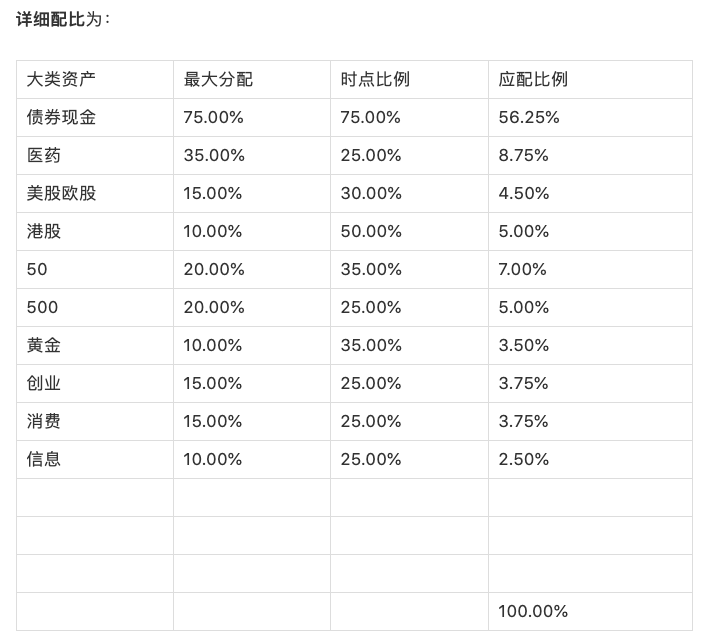
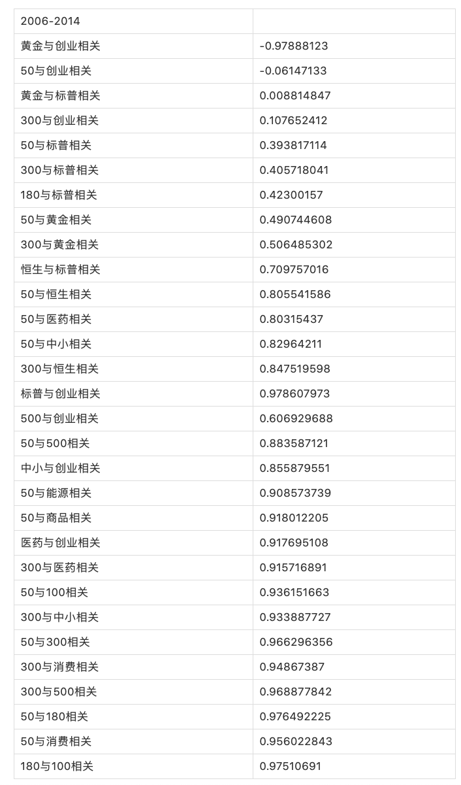

# 2015年三季度金融资产配置建议

由于二季度沪深股市继续暴涨，除上证50指数外，其余所有指数已经远远超过历史估值一倍以上。
所以，

- 除50etf外，其余沪深指数配置都应根据规则降至最低持仓线25%；

- 港股方面，估值依然在历史均值附近徘徊，所以给出50%配比；

- 美欧股市方面，超出均值并不远，建议给30%配比。亦可根据自身情况上升至40%仓位；

- 黄金没有pe值做为参考，但根据经验，与油价对比稍显高估，给出35%仓位；

- 债券给出配比上限75%仓位。推荐布局一部分分级A类，比例根据自身情况确定。可以持有少部分石油相关品种。

详细配比为：

## 金融资产配置原则

投资的本质，是资金配置的艺术。

如何将有限的资金，在恰当的时机配置在金融、房产、收藏品等领域，是每个人需要面对的问题。

每一个大类资产又是一门艺术。

今天重点说金融资产配置原则:

### 1. 找到相关度低的资产

金融资产的配置，关键是
**要将金融资产配置到相关度极低的资产中。**

否则你的资产同涨同跌，赚起来当然开心不已，但赔起来想必不会舒服。
所以，金融资产配置的第一步，是找到相关度低的资产。

2006年至2014年，中国金融资本市场，可以在沪深交易所购买的金融产品相关度为（100是完全相关，0是完全不相关，低于0负相关）：

50与创业相关	-0.06147133
50与标普相关	0.393817114
50与黄金相关	0.490744608
50与医药相关	0.80315437
50与恒生相关	0.805541586
50与中小相关	0.82964211
50与能源相关	0.908573739
50与商品相关	0.918012205
50与100相关	0.936151663
50与消费相关	0.956022843
50与300相关	0.966296356
50与180相关	0.976492225

黄金与创业相关	-0.97888123
黄金与标普相关	0.008814847
300与创业相关	0.107652412
300与标普相关	0.405718041
180与标普相关	0.42300157
300与黄金相关	0.506485302
恒生与标普相关	0.709757016
300与恒生相关	0.847519598
标普与创业相关	0.978607973
500与创业相关	0.606929688
50与500相关	0.883587121
中小与创业相关	0.855879551
医药与创业相关	0.917695108
300与医药相关	0.915716891
300与中小相关	0.933887727
300与消费相关	0.94867387
300与500相关	0.968877842
180与100相关	0.97510691

2015-0615_投资分级A：宁拿25%收益哭，也不在万点牛市笑

### 2. 确定各品种的权重

**金融资产配置的第二步，就是确定各品种的权重。**

这里，要用到的是每个品种的估值。

**成功的金融产品投资**，有三个方法：

- 价值法
- 趋势法
- 量化法

#### 1) 价值

价值这些年在中国比较流行，每样东西都有价值，而市场给出的价格却忽高忽低。能判断价值的人就能低买高卖赚钱。

#### 2) 趋势

而趋势法则是顺势而为，均线也好，macd也好，bbi也好，牛市持有，熊市空仓。

#### 3) 量化

量化不多说，比较专业。
总的来说是根据大数据统计有效因子，然后再建立模型进行投资。

#### 4) 总结

我们选用**价值法配置权重**：

1. 找出历史估值中枢
1. 在这个中枢布置50%配比
1. 随着估值上升，配比下降，直至25%底线。
1. 反之，随着估值下降，买入该类产品，直至75%上限。

### 3. 操作

金融资产配置的第三部，是操作。

资产配置，不能天天盯着大盘追涨杀跌。
要给出上涨或下跌的空间与时间。
你才能在某类资产暴涨一段时间后，获利了结一部分，买入走熊很久的另一类资产。
这个过程间隔不能太短，否则摘芝麻丢西瓜。

三个月是最短，半年最好。
我们选择季度，三个月。

至此，金融资产配置完毕。关上交易软件，专心去做自己的事。三个月后，打开潘多拉魔盒，继续收割与播种。