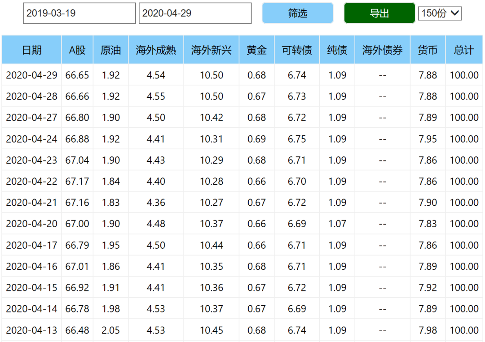
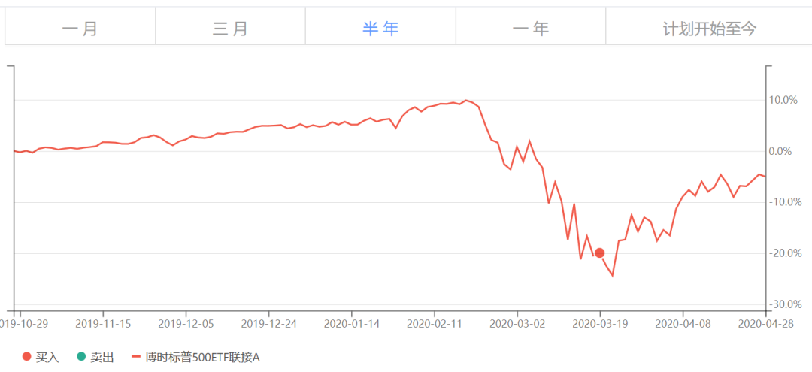

# *2020-04-30* 关于我们的配置

https://mp.weixin.qq.com/s/NHrXZSceR-3xEs2A09VT0Q

## 壹：关于四月没有发车

4月份没有发车文章，四年多来这倒是首次。

### 原因1. 资产配置非常好

最主要的原因当然是150资产配置在目前的情况下非常好，没有太大调整空间。

而S是很多没有积蓄的朋友参考的计划，在这样的大环境下，我是希望为你多留一些资金在手里。

我希望各位明白的是，在我心里，这不仅仅是一个投资计划，更是我时时刻刻站在你的角度上，为你的现在、未来资金安全，保值增值考虑周全的一个计划。这个后面再详细说。

由于4月份已经再次蓄力一个月，所以这次S可以继续加仓。

我会尽量帮助你在这种不确定的时刻现金与权益类资产同步增加，使得风险/收益都可控。

### 原因2. 三月份已经连发八车。

### 原因3. 最近特别特别忙

各位也能看出每次发车文章都是多么精致。

不仅要计算、制作收益率+资产配置图，还要写一篇一个错别字都不能出现的文字，不用说还有精挑细选的题图和BGM。

因为追求完美，所以其实每次发车都非常非常麻烦也非常累。

所以4月没有推送文章还请大家谅解。

所以有些朋友留言抱怨，其实我想一想，也应该理解。

怪我没有说明——其实没有推送文字说明不发车也是怕打扰大家，毕竟每天每个人微信的信息轰炸已经太多了。

不过理解归理解，我希望每位朋友了解的是：

正如你所见，这个公众号绝对是与众不同的一个。

每个公众号的作者，当然都希望关注的人多一点，阅读量大一点。

每个人的目的不同，对我本人来说，这仅仅是为了满足自己一点虚荣的成就感而已。

有更多人看更好，越来越少也没什么不可以接受。

我不会为了追求浏览量就每天发一篇生搬硬凑的文字吸引流量，只会在自己觉得言之有物的时候精心制作一篇文章推送给您。

更因为不是“定投”，不会每个月必须买。

所以既然您要关注，就得接受这个事实。

如果不能接受，我也只能遗憾的说声走好不送。

## 贰：关于我们的配置

我不知道你的感觉如何，目前的配置让我非常非常舒服。

因为需要实时监测资产配置变化，所以我有一个每天自动更新的配置表格。

每天我看着这个表格都会感到非常舒服。

做资产配置旭日图太麻烦，每天让小助理更新的话工作时间太长我发不起工资。

只能每个月更新一次，有朋友抱怨为什么不经常更新旭日图和收益率，还请理解。

更新没问题，有问题的是我太穷了……

### 当前配置

当这个表格上的某项资产占比过高或过低，让我感到不舒服了，我就会调仓。

这次150只进行了大类内部调仓，你就应该知道目前的配置非常舒服。

### 海外成熟

配置缺陷

当然，配置方面目前还有一些缺陷。

最大的缺陷是海外成熟配置不足。目前美国+德国占比4个多点，最多我可以给到20%。

但这个不能急。

就好像过去三四年任何时候你急了，买入美股，今年都会被套一样。

你可以回去看一下我们那一份标普500的买入位置——这轮下跌次低日。

所以买

当然还会买，至少至少也会买到占比10%。

但要等到时机合适，那样我才舒服。

### A股方面

67%的配置非常舒服。

有朋友觉得低了，其实我倒觉得目前的形势看，也许还有些高。

截至今天我写这篇文章的时候，84.21%的公司已经披露一季报。

不出所料，情况不乐观。

全市场扣非利润单季同比下降25%以上。

分行业看，就连一向生冷不忌利润持续增长的医药和消费，一季度利润也有将近10个点的下降。

这是一季度，谁敢说二季度就一定转好？

恐怕未必。

所以67%已经不低，何况还有接近7%的转债仓位。

维持这么高的持仓是因为A股依然不贵，所以除了内部品种增增减减，并不需要减仓。

### 债券方面

从长期视角看，目前债券仓位已经没有持有意义。

未来合适的时候会清掉。

### 原油

目前组合中唯一浮亏的大类就是今年从60跌到10块的原油。这部分我本人并不是非常担心。

油气与416石油基金持仓的都是石油公司股票，出现大问题的风险并不大，尤其是416更是相对稳妥。

之前也有很多朋友接受我在微博的建议将油气转成416进行了跨品种套利，效果也非常好。

唯一的南方油挂钩原油期货，本来想在30美元做个短差，结果没有成功。

对我来说，当然要尽量做到所有品种都成功赚钱，永不出现浮亏。

但我也深知**人生在世万不可过分求全**。

世界上没有完美的人、物、事。

追求完美固然好，但不完美出现也要接受。

一个组合，占比0.4%的品种大幅下跌是可以接受的。

接受之后反思，争取未来做得更好。

南方油跌幅较大，好在很多朋友已经转场内，有惊无险安然卖出，甚至小有盈利。

还没来得及卖的朋友也不用太担心，毕竟无论是150还是S，都只有一份。

而且我考虑，还是有机会安全离场的。

我的投资原则是不亏损卖出，想尽办法也要把持仓都折腾盈利了再卖。

多大点事儿，都踏踏实实的。

我喜欢金融投资，并非只是为了挣钱。

更大的快乐，来自于只要你够理性，就能不断的得到来自于市场的奖赏。

这是一种无与伦比的乐趣，时间久了，相信你也能感受到。

祝大家节日快乐。假期出去玩别跟人扎堆，人多没好事。