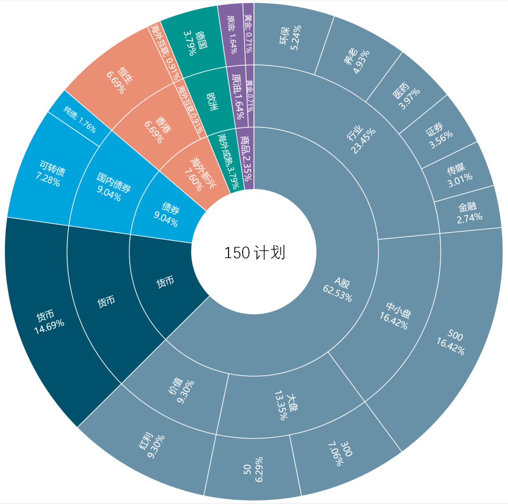

# 发车文章：设计适合你自己的资产配置组合(一)

知道不知道我已经有多久没写发车文章了？

126天，整整4个月了。

主要原因不是懒或者忙（绝对不是）。

而是因为行情非常稳定，即使中间有过大涨大跌，在我们的眼中，也不过是小波动而已。

不需要大量买入，不需要大量卖出，所以也不用说太多。

佛系持有就行，各位大爷吃好喝好。

前几天，我发了一篇关于千万资产的文章。

评论里有不少富豪朋友问到关于如何稳定获取x%收益率的问题。

加上今天我们又买了一份债券，那我就简单展开说说资产配置的问题。

我们从获取**无风险/低风险收益率**开始说。

世界上没有绝对的无风险投资。

银行存款算是最最安全的投资了吧？

难道银行没有倒闭的可能吗。万分之一，十万分之一的可能也是可能。

所以我们讨论的“无风险”，只能是相对来说的无风险。或者说，低风险。

每个人的风险偏好是不同的：

##### 资产千万亿万的人

重视的是如何让自己的资产稳定增值。因为几个点的收益，绝对值就已经非常高；

##### 资产较少的人

会追求相对较高的收益率。

因为收益率太低意义不是太大。

比如你拿5000元来投资，每年收益10%，已经非常非常不错了吧，绝对值也只有500元，吃两顿饭或者买两件衣服就没了。

更别提10%的低风险年收益率已经非常困难。

同样，年纪大的人会追求稳定。因为留给他们的犯错空间越来越小了。

一旦投资不利，会影响退休后稳定安逸的生活。

而刚毕业的年轻人则不同，他们即使在一次牛熊中损失大半，也依然有至少5-7次大牛市在前面等着他。

所以相对来说他们会激进一些。

所以你的需求是独一无二的。

你可以把自己代入四个象限，分别是：

- 钱多的年轻人
- 钱少的年轻人
- 钱多的中老年人
- 钱少的中老年人

找准自己的定位后，再开始制定适合你自己的投资组合。

四个象限中，除了钱少的年轻人，**其他三类我都建议认真研究无风险/低风险组合（以下简称低风险组合）**，

因为这类组合适合你们。

**同时，即使你追求高风险组合，也应该在低风险的基础上进化**。

这样，你才对投资会有一个大局观。

我之前说过很多次，老一代国人对于投资的态度分为两种：

- 第一种是认为金融投资都是骗子，一定赚不到钱。

  所以他们只敢存银行、买理财、买国债。

- 第二种是赌徒。

  他们疯狂追求高收益，他们牛市入场买股票、买p 2 p、买数字货币、买任何他们认为能快速获利的东西。

我衷心希望，新一代的中国年轻人不再重复这两条路。

什么是资产配置？

如果你注意到我们每次发车文章的这张图，你就会懂：

注意这张图从内开始

#### 第二圈的类别

分别是：

- A股、
- 货币、
- 债券、
- 海外新兴市场股票、
- 海外成熟市场股票、
- 商品。

#### 第三圈更加细分

在以上大类中，再次细分为：

- A股价值股、
- A股大盘股、
- A股中小盘股、
- A股行业股、
- 国内债券、
- 海外债券、
- 港股、
- 海外互联、
- 欧洲、
- 美国、
- 原油、
- 黄金。

第四层则分得更细。

这，就是资产配置。

也许看到这里你的头已经开始疼了。别急，这已经是相当高级、复杂的资产配置方式。一开始，你完全没有必要这样设计。你只要这样做，就能做好一个低风险组合配置：

### 第一层：85%债券+15%A股(沪深300），每年年末再平衡。

是不是非常简单？每年只要花费很少很少的时间，就可以取得极低风险下的可接受收益率。

这个组合，在过去十年中，只有2013年股债双杀的情况下亏损了不到5%，其它所有年份都取得了盈利，年化收益率4%-5%。

你是不是觉得太低了？确实不高。不要急，我们一层一层来。从最简单的开始，每个人根据自己的情况各取所需。

### 第二层：动态平衡。

你有没有发现我们的150计划仓位是不断变化的。

2015年7月，股灾前最高点时，我们的现金仓位几乎占了100%，A股基本没有。

之后，随着市场不断下跌，我们的权益类资产占比越来越大，最终在2018年钻石坑前附近大幅提升。

一直到现在，没有再发生大的变化。

这就是“动态”平衡。

这时，不再将债券与A股的比例固定。

而是根据市场估值状态动态调整。

在低风险配置概念中，我建议你将债券的波动范围设置在70%-95%，股票的波动范围设置在5%-30%。

如果你愿意提升风险容忍度，获取更高的收益率，可以加大股票仓位波动范围。第一层的固定比例也是如此，可以设置80：20或者75：25等。

动态平衡后，风险并未大幅增加，依然可以做到除了2013年外每年盈利，但年化收益率已经可以提升到超过7%。

写着写着发现已经太多了，一次写不完，我们就下次继续说吧。

再说一次，资产配置是由浅入深，循序渐进。

从固定比例到动态比例，到后面操作难度和收益率加大、也更加有趣的配置方式，相信至少会给你一些启发，完善自己的系统。

有人说，搞这么复杂干嘛，我直接买个配置基金不行吗？

不行。

你以前不会，现在不会，以后也绝对不会把所有资金买入一只/一类品种。

只要你手上还有钱，那你就需要“资产配置”的理念。

当你在熊市低位，看着手里那只配置基金浮亏30%却不得不拿钱出来买房/结婚/治病/孩子上学的时候，你才会知道资产配置的重要性。

即使你那只配置基金之后在牛市中赚了70%，也与你无关了。

因为，熊市中急用钱的你，把它亏损卖掉了。

除非你穷困一生，永远没有闲钱进行金融投资。

不然的话，资产配置是你必须上的一节必修课。

我愿意与你分享我十几年配置经验的一些心得，希望你喜欢，更希望对你有用。

下次接着说。