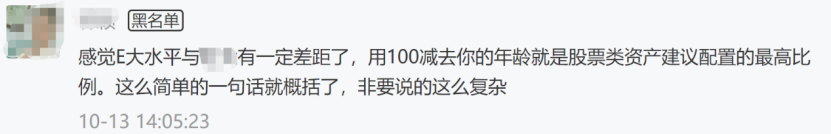

# 20201030-资产配置3.0
**副标题：设计适合你自己的资产配置组合(二)**

我们讨论了资产配置最基本的两种方式：

- 固定股债比例
- 根据估值动态调整股债比例

今天我们继续讨论更深层次的资产配置方式。

在正式讨论大餐之前，我们先上个小甜点。

上次的公众号文章发布后，有人在评论里说：

看完这条留言，我不由得感叹，这得无知和逻辑混乱到什么地步才能说出这样的话啊。

首先咱们分析逻辑。

在那篇文章里，我通篇介绍的是如何做资产配置。

即，最基本的股债再平衡与高一级的动态平衡。除了作为例子举出的80:20，以及后面提到可以根据你的情况变化比例外，一个字都没写你的股债“应该”是多少。

我写的是大的策略，你来跟我讨论股债比例具体是多少？我不禁满脸问号。

其次，您推崇的这位告诉您的这个方法，100年前就已经有人在书里写过了。它是不是最合适、最科学，是不是适合每个人的确定仓位方法我不知道，我只知道，您是真的无知无畏。

甜点时间结束，下一拨名媛请就位，正餐来了。

你是不是经常听人说，股票是收益率最高的投资品种？如果是，那么为什么我们要配置股票和债券两个品种？为什么要“再平衡”？

第一个原因，在于配置两种不相关的品种后，你的收益率会变得更加平缓、波动降低，同时长期收益率也会提高。

2008年和2015年下半年，两市股票平均跌幅超过60%。你千万不要低估这个跌幅的杀伤力以及高估你自己的承受力。如果你不幸高位满仓买入，那么你需要赚100%以上才能回本。（之后我会专门写一篇有趣的投资数学文章）

然而如果你做了动态平衡，则回本的时间以及资产损失的幅度会大幅降低。

同时，再平衡天然的低买高卖动作也会极大提高你的长期收益率。

第二个原因，在于会大幅降低你的焦虑心态。

这个老朋友都懂，不多说了。

在掌握最基础的两种配置方法后，我们需要考虑的是如何在这个基础上进一步提高收益率。

再平衡本质上是一种“低买高卖”策略。

1. 当某类资产跌幅较大后，其在你的资产配置中比例会降低。
2. 这时候你进行再平衡，则等于低位买入。
3. 同时，高位卖出了上涨的那个不相关品种，客观上实现了股神级别的操作。

动态仓位平衡则是进一步提出了低位加大仓位，高位降低仓位的理念。

那么再进一步呢？

### 再进一步就是在“品种”上下手。

之前我们举的再平衡4-6%，动态再平衡接近8%的十年收益率，是基于“沪深300”这个指数。

这个指数基本能代表A股的走势，但它当然不算表现很好的指数。如果你希望进一步提升收益率，就要选一些能够战胜它的品种。

### 我的推荐

1. 第一位是.   增强指数基金”；
2. 第二位是.    优质的行业基金；
3. 第三位是.    优质的主动基金。

在A股，第一位的增强指基以及第三类的优质主动基金，能够跑赢基准的原因有两个：

**第一是因为A股是个散户市场**，

85%以上的成交量都由散户贡献，这样机构割韭菜就会很方便高效，客观上让这两类基金取得超越指数的收益。

**第二是因为机构会“抱团”**。

目前A股市场的抱团效应已经达到历史最高区域。

也就是说，大量机构将资金集中在几十只股票以及几个行业上。这样，这几十只以及这些行业的股票就会不断上涨，最终导致主动基金业绩表现不错。（这样的状态会有很大的后遗症，未来各位会懂）

第二种优质行业基金不用说了。记得我几年前提出的几个行业吗？依然没有变。医药+消费+信息产业（科技+中概互联）。未来10-20年记住这三个行业就可以了。

这三个品种中，配置难度从小到大是

**行业 < 增强指基 < 优质主动基金**

也就是说，行业最好选择，增强指基选择难度中等，优质主动基金难度最大。

这是因为目前A股有超过4000只主动基金，为什么难选我也在过去的文章中说过了，可以去翻翻。

总而言之，到了这一步，资产配置第三层级已经呼之欲出：

用动态平衡的方式，操作优质行业+优质增强指基（标准指基亦可，大小平衡，如300+500）+优质主动基金。

我相信一直到这一步，对70%以上的朋友来说都不难。具体操作步骤如下：

##### 首先，确定你的调仓周期。

最低不要低于三个月，最高不要超过一年。

原因我不解释，我建议经验少的朋友可以六个月调整一次。

#####  其次，确定你的最高、最低仓位。

你可以参考前面小甜点那里介绍的方法，也可以用其它方法（以后有机会也要介绍），确定自己的仓位上下限。

我建议除非特别激进的朋友，股票仓位最好不要超过80%-85%。

如果你只是个普通投资者，那么5:5或者6:4都很适合。

##### 第三，确定你的品种

我的建议是增强或标准宽基指数基金（50、300、500、1000、创业、科创）与优质行业基金结合。

有能力可以再去找几个优质主动基金加入配置。

这里要注意，这只是我的建议，如果你学有余力，这部分的配置甚至可以延伸到个股上。

买了好股票赚钱，同时可以有打新收益。

只要是股票类资产，都可以算作仓位。

只是我强烈建议70%的普通投资者就不要买个股了。

也就是说，只要是A股股票类资产，无论你买入什么都可以。

只是我本人会推荐上述几个品种给普通投资者而已。

##### 第四，考虑目前合适的仓位

这个可以考虑估值，也可以参考我经常会给出的仓位建议。

##### 第五，定期实施你的计划。

是不是看起来很麻烦，其实一点都不麻烦。

更何况，开始制定策略后，半年以上才需要调整一次仓位比例，简直不要太轻松。

如果一切顺利，你的长期年化收益率已经可以达到8%-10%以上了。

第三层的资产配置就到这里吧。后面还有第四以及第五层。

敬请期待。

PS：我介绍的资产配置方法，不止适用于你投入股市的那点钱，即使你用在除了应急准备金的所有家庭流动资产上，也是非常合适的。请一定根据自己的情况认真思考、实践以及总结。

PPS：我发现把干货放到发车文章里看的人就少，单独拿出来看的人就多。这不科学。

坚持不发水文的公众号已经不多了！救救孩子！