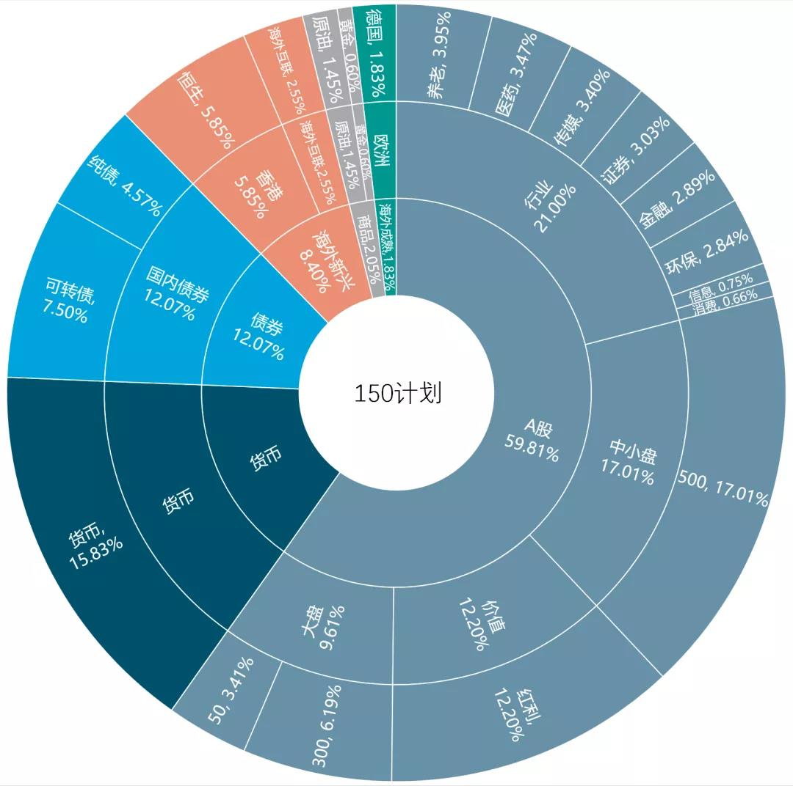
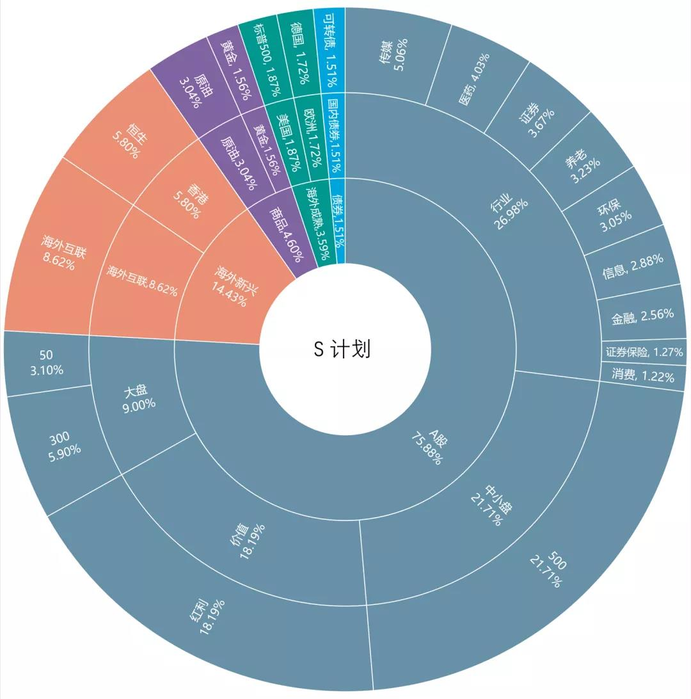
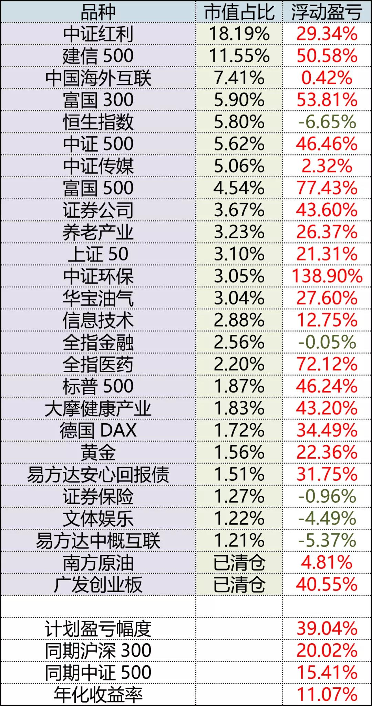

# [2021年12月ETF计划（一）：S卖出一份&第一道数学题](https://mp.weixin.qq.com/s/uxkJqpym95XoJ7b9Z53xmw)

>新朋友先点击查看Q&A，你大多数困惑里面都有答案：
>
>ETF计划Q&A（2017版）
>
>朋友们，开始浏览本月ETF计划前，请仔细阅读以下几点：
>
>1、本计划绝非任何形式的投资建议或是投资指导。
>
>这个计划只是我个人的投资计划。始于2005年，目前正在进行2015年7月开始的第三轮。2010年第二轮开始，有朋友参考这个计划投资。到了这一轮，参考的朋友更多了。 
>
>如果这个计划能帮助您，我们会替您感到高兴，仅此而已。我们绝不会向您以各种形式收费、分成。如果您因为这个计划而亏损，我们也只能说一声很遗憾。也是仅此而已，我们不会承担任何责任。
>
>2、请任何朋友开始参考这个计划前，要再三考虑自己是否能忍受甚至可能长达3-4年的熊市。
>
>本计划虽然过去17年取得了超过15倍的盈利，但大家要知道，在17年中，真正让利润大幅增长的时间大概只有5-6年的三次大牛市。中国股市是个牛短熊长的市场。我们在超过7年的大熊市中慢慢买入，最终才取得了牛市利润的爆发。你一定要清楚，70%以上的人无法忍耐几年的熊市。所以，确认你自己能忍，再开始参考本计划。同时，未来会有多少收益我们并不知道。因为我们无法预计未来的市场会怎么走。
>
>3、未投入的剩余资金可以去买任何你想买的投资品种。只要每个月初用的时候能到位即可。如果某个月会投入5份以上的资金，会提前3天到一周说明。
>
>4、第三轮ETF计划的每篇推送，可以回复年月数字查看。从“1507”开始。也可以在公众号主页下方菜单选择“投资计划”栏目查看。

## 2021年12月第一次操作计划——150份

本次不操作

## 2021年12月第一次操作计划——S定投

S定投专为没有150份资产

只有每月结余的朋友们量身定制

卖出美国标普500一份

（场外050025或161125）

(推荐在“且慢”自动跟车）

----

## 150份资产配置&收益率

## 到目前为止，还没有买入的往期计划

50ETF     （510050）一份  （价格不超过2.117（分红调整价格）、2016年8月计划）

食品饮料  （160222）一份 （对应国证食品饮料399396不超过8000点、2016年10月计划）

180ETF   （510180）一份  （价格不超过2.84、2016年10月计划）

----  
  

## 颠覆你三观的一些投资数学题

你一定听说过一道关于投资的数学题：

如果你持有的股票下跌33%，那么需要上涨50%才能回本；如果你持仓的基金下跌50%，那么，上涨100%才能打平。

这道数学题非常重要。因为有一些投资经验的朋友，都会知道买入、持有一个翻番的品种有多么不容易。如果它翻番后的结果居然只是回本那么就太让人心碎了。

所以，从这道数学题上我们可以总结出一条投资经验：

永远不要让你的资产大幅缩水，否则，回到高位，再创新高将是非常困难的。

今天开始，我会跟各位聊六道我认为同样有趣，同样能给人启发的，关于投资的数学题。

相信它们中至少有一道会颠覆你的三观。

下面是第一道题。

---

## 第一道题：大起大落，注定平庸，甚至消灭财富

**题目：**

**如果上帝让你在以下两种场景中选择一种作为你未来的投资收益率，你会选哪个？**

**1：第一年赚80%，第二年赔40%，第三年赚80%，第四年赔40%……**

**2：每年赚5%。**

我相信大多数朋友会选第一种。各位大湾区卧龙、江浙沪凤雏心里清楚明白：第一年赚80%，第二年赔40%，那两年合计能赚40%，每年20%啊！当然比5%强。

不好意思，事实是，在偶数年，第一种情况的年化收益率是4%左右，还真不如第二种的每年5%。

那位朋友说了，那要是单数年赚80%就走了不玩了呢。

那，也行吧。你赢了。不过，你见过赌赢的赌徒下桌的吗？你炒股买基金赚钱了，你走了吗。

从这道题上我能学到的是，一年两年赚得多什么也不能代表。重要的是你赚到的能不能守住。如果守不住，不如去买个收益率高点的银行理财。

再说个你想不到的，如果单数年赚90%，双数年赔50%，那么长期收益率居然是负的。

投资这玩意儿，不到最后，别说谁胜谁负。

另外，如果你在熊市中没有亏损，而另一个人亏损了30%。那么如果牛市中你赚了40%，他需要赚100%才能与你打平。

这就是为什么我总是强调熊市不赔钱或者极少亏损，牛市大致跟上指数的原因。如果几轮市场周期你都做到了，你赚到的钱是那些大起大落的人永远也赚不到的。

**最重要的，你知道为什么投资的世界总是赔钱的人比较多吗。**

我现在问您，您知道多少公募和私募的基金经理。嗯，知识面广一点的朋友也许知道十几个二十几个非常著名的。

那您知道有多少各类基金经理吗？

至少有上万人。

这上万人绝大多数因为没有名气，所以管理的基金规模都不大。当他们在某年赚到很多钱的时候，其实赚的绝对数字很小。比如10个亿规模，赚100%，规模到了20个亿，赚了10个亿。

这样他在牛市成为冠军基金经理，名气大增，申购量暴增5倍、10倍。于是，他管理了100亿资金。好的，熊市来了，这时候当他赔40%，那么两年合计，到底赚了多少钱呢？

亏损40亿-盈利10亿=消失30亿。

然而他第一年赚100%，第二年赔40%，其实两年合计收益率还是正的。但是30亿就这么消失了。

实际上，当他的规模到了100亿以后，**只要下跌10%，之前牛市赚到的100%利润就已经消失殆尽了。**

这个道理，也同样适合散户朋友。当你用一点点小钱在牛市中赚了幅度很大的钱，然后开始信心十足的转移储蓄加码买入的时候，很有可能是在消灭财富的前夜。

即使跌幅比涨幅小很多。

为什么我在微博和公众号说了一年多请新朋友不要跟，希望你真的明白我的苦心。

**我不希望你的财富消失在我们赚钱的策略里。**

最后，聪明的你一定想到了一个相关问题：如果我反过来做，熊市赔大钱的时候加码，牛市赚大钱的时候减码会怎么样呢？

PS，今天这首BGM只为梦姐打call。

一个男人慵懒又迷茫的念叨着一场游戏一场梦，想要幸福，又犹犹豫豫。

这时候女孩坚定的站出来说“我爱你”。于是，男人也变得坚定起来。

炸了。

“和你在一起，和你在一起！”

啊，这该死的爱情。

