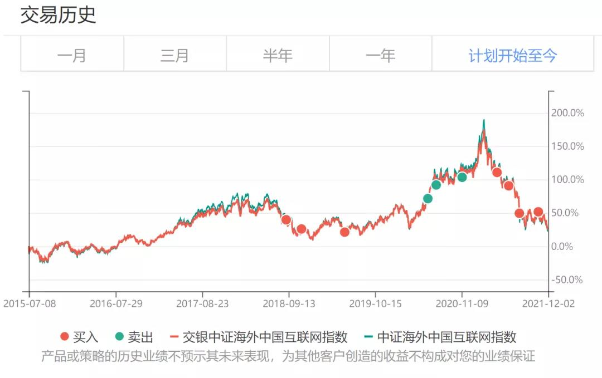
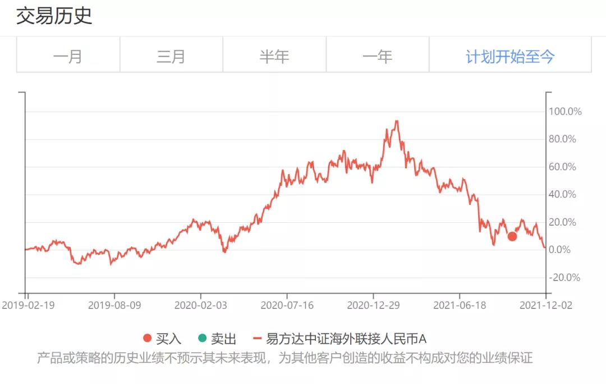
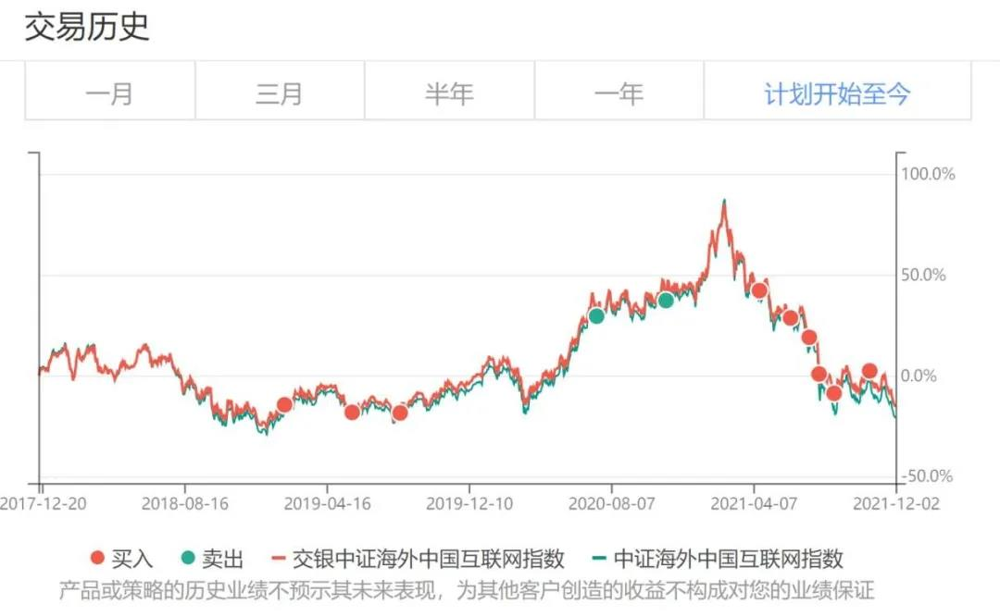

# [第二、第三道投资数学题；应用题——中概](https://mp.weixin.qq.com/s/blbcvoeK0Ed-sOlIEvebuw)

我知道，某些现在看这段文字的朋友，内心充满了焦虑、恐惧、不知所措，或许还有悔恨。

而更多朋友，则兴奋、激动、战斗欲望爆棚，摩拳擦掌想要做一番大事。

这样，各位平复一下躁动的小心灵，先冷静下来。去上个厕所，倒一杯自己喜欢的饮料，找一个舒服的地方坐下或者躺下，安安静静的把我这篇东西看完。

别急，急什么呢，没什么好急的。多大点事儿，都踏踏实实的。

那咱们先从第二道数学题开始。

---

## 第二道数学题：80-50≠30

**题目：**

**根据7080定律，如果一个不会死的品种极限跌幅在80%，那么，你在腰斩，也就是下跌50%的地方买入，到了跌幅80%的地方，你的亏损幅度是多少？**

**答案：并非你认为的80%-50%=30%，而是60%。**

同理，你在同样品种已经下跌60%的地方买入，到了下跌80%的时候并非浮亏20%，而是50%。在已经下跌了70%的地方买入，到了下跌80%的时候并非浮亏10%，而是33.33%。

永远永远不要用想象去计算数学题。这道题的本质，就是告诉你当一个品种下跌，从0到-10%的距离，与 -70%到-80% 的距离完全不同。这也是为什么熊市越到后来越惨烈的原因。那个时候财富的缩水远超一般人的承受能力，即使账面只变动了几个百分点。在熊市的末期，大多数一路抄底的人都会彻底崩溃。因为他们的损失只比站在山顶上的人小一点而已。

你，还会疯狂的抄底吗。

说到抄底，那么第三道数学题必须出现了。

## 第三道数学题：不死品种浮亏后获利的最终奥义：补仓

**题目：**

**2块钱的价格买入1000元某指数基金。跌到1块钱的时候再买1000元，这时候你的成本是多少？**

**答案：并不是你以为的1.5元，而是1.33元。**

当这只指数基金涨回2元起点的时候，你获利50%。

很好，我们继续这场刺激的巨额浮亏之旅。

如果价格从2元跌到1元的时候，你买入的不是1000元，而是省吃俭用忍痛买入了2000元，那么你的成本将从1.33直降到1.2。不要小看这0.13元的成本下降，它将你回到起点的盈利幅度从50%提升到66.67%。而你的获利也从1000元上升到了2000元，绝对获利金额增加了100%。

如果从回本的角度讲，第一种方式在1元的时候要涨33%回本，第二种方式只要涨20%就回本。

那么，这道题告诉我们什么呢？

它给我的启示是，首先要弄清楚一个品种在这个时候买入还有可能跌多少。如果大概率还要继续跌，那么我买入多少后，未来大幅下跌后我是否还有能力补仓，降低成本，将一个“不成功”的投资做成反败为胜。

对了，还有一点没跟你说，如果你觉得2元买入是有价值的，而后面的下跌50%真的是错杀，那么最后这个品种涨了50%，到了3元，那么你用后一种补仓方式将盈利：

150%。

你真的那么害怕下跌吗？拜托，下跌才是暴利的源泉好吗。

## 应用题：中概互联

昨晚，美股市场中概股票再遭屠杀。中概互联基金KWEB收盘大跌6.96%，盘中最大跌幅9.29%。

如一开始所述，我相信有朋友目前心态已崩，或者已经到了崩溃的边缘。而更多的朋友则充满了兴奋的感觉，觉得大机会到了，恨不得立即满仓买入赚大钱。

都别慌，冷静一下。不要失去理智，我们来理性客观的分析一下各种因素，然后制定下一步的作战计划。

## 第一步，知己

知己知彼，百战不殆。我们是来资本市场打仗的，是从别人兜里抢钱的。自己是什么情况都不知道，仗怎么打？

ETF投资计划，150计划：

150目前持仓交银海外互联4份，占比1.85%，浮盈7.44%；易方达中概互联1份，占比0.54%，浮亏7.44%。

两者合计占比2.39%，在150份资金中占了5份。

ETF投资计划，S计划：

S目前持仓交银海外互联7份，占比7.12%，浮亏3.33%；易方达中概互联1份，占比1.18%，浮亏7.44%。

两者合计占比8.3%，合计为8份资金，即4个月可投资资产。

**（这里要说明一下，有朋友有疑问，为什么中概互联自己的盈亏状态与我的不同，因为我们在2019年买入，2020年卖出，有过一波盈利。你没有，或者你的交易软件没有计入。）**

网格计划：

目前网格交易过7个品种，中概是唯一浮亏的。浮亏幅度**11%**。

过去几个月该品种提款三次，目前持仓**6份**。最大压力测试自首网开始最大跌幅为**60%**，目前首网至今跌幅**23.4%**。

分析：

首先，**150**没什么好说的。一共就持仓2个百分点，全部亏光就是赔2%。我个人认为全部亏光的可能性很小。

同时，目前我认为2%的仓位太低。未来即使翻番，赚三瓜两枣意义不大。所以我会加仓。

其次，**S**也没什么好说的。

看起来仓位很高，8%。实际情况并非如此。

S计划过去十二个月买入**14**次，卖出**9**次。净买入**5**次。按照我们的买入原则，每份S买入是当月可投资资产的1/2,那么就相当于只买入了2个半月的可投资资产，你应该积攒了**9.5**个月的现金才对。这只是说过去12个月，过去几年S计划攒了多少应投未投的，各位都清楚。

把这部分算进来，你的仓位才多少？

我不发车，不是让你把钱糟蹋了，而是让你留着——现在这种时候用。

再看网格：

如果有网格现金流出现问题的朋友，我请你再回头看网格三篇：

波段策略.网格之一：写在前面、体系以及策略

波段策略.网格之二：网格策略基础/1.0版

波段策略.网格之三：网格策略进阶/2.0版

其中最重要的我帮你找出来。

“一定要做好**压力测试**。网格策略最关键的地方不是能赚多少钱，而是你可以知道最坏情况发生后，自己的账户会怎样。有了这样的准备，无论从策略设计本身又或者你的心态，都会受益匪浅。所以，这是你在本篇文章中要记住的第二句话：**压力测试是最重要的**。”

“只要一个品种不会死，一定是价格越低价值越大。同时，见底以及波动的可能性也逐渐增加。所以，每一格增加一定投入，最终可以获取更大的利润。这也一定程度上缓解了1.0系统中底部利润过低的缺陷。怎么加呢，**永远要牢记压力测试的重要性**。列表格，列出最坏情况下自己是否还能坚持。然后逐渐加码，你可以尝试从第二格开始，每格比上一格加5%。算到最后你发现自己资金和心理状态扛不住了，没关系，那就从第三格开始加码，前两格用同样的金额。如果还是扛不住，那就从第四格开始。如果你发现到最后自己的状态也非常轻松，那就每格增加7%，或者10%。总而言之，因为所有交易在交易开始前你就已经开始计划，所以无论如何调整都没有任何问题。只要你不过高或者过低估计自己的实际情况，那么怎么调整细节是非常自由的。”

“我建议你再把这篇文章读五遍。当然，你只读一遍也可以。**不过未来你真的实践后再来看这篇文章，一定会后悔没有多读几遍**。知道为什么吗，因为，本人对近十年实践网格策略的失误和教训的反思和总结都在这篇文章里了。这3511个字，会为你节省5-10年的试错时间。它多么有价值，也许你永远都意识不到。”

简单来说，你遇到的所有问题，我都已经提前为你想到了，也已经给了你解决的办法。这不是我未卜先知，而是我用自己十几年的有效投资经验帮你探路、试错总结出来的经验。

说回现在。如果你没有做好压力测试就贸然开始，并在过程中不断犯错，现在已经有心无力继续下去，那么我给你的建议就是，立即重新梳理自己的资金与自己的计划。在无力继续买入的情况下，就停止买入。等待之前的条件单完成提款。没有关系，你损失的无非就是下面的一些利润。这是我能想到的建议。

**我来最后总结一下**。

我的结论就是，150和S的中概互联占比都很低，不用过于担心。

网格预计最大跌幅60%，目前跌幅23.4%，完全在压力测试范围内。如果你的压力测试是60%，而在下跌23%的时候已经崩溃，那么我不知道你的压力测试意义在哪里。

如果你没有做过压力测试就开始了，请你出去。

## 第二步，知彼

目前中概可谓内忧外患。

内忧不多说。外患方面，你肯定听人说中概股票要全部在美股市场退市了，因为美国出了一个《外国公司问责法案》。

但是你可能不知道一个基础知识，这个法案是什么时候通过的？2020年5月，美国会参议院通过。12月，众议院表决通过。你敢不敢看看去年5月到今年2月中概的涨幅？

再看看我们计划上一波卖出中概的时间。我们考虑到了这个法案的影响，谁知道还是太幼稚，卖早了。最后中概的估值居然在崩盘前拉到了50多倍。

这个法案最终修正案是今年3月正式通过的。这也是为什么这两年美国上市的中概公司纷纷回港二次上市。大家早就开始做准备了。

也就是说，这件事确定已经好几个月甚至一年以上了，最近市场才反应过来，才开始暴跌吗？

当然不是。

那么，我相信有朋友会非常关心，那么到底会不会退市？如果退市了会怎样？

我说句实话，我不知道是不是所有公司都退市。至于万一退了会怎样，还能怎样，大公司ADR换到香港呗。本来中概在美股上市也都是ADR。那么在过程中会怎样？会暴跌吗，个股会归零吗？

对不起，我还是不知道。你别看我对未来的事情一问三不知，但我知道一件事，那就是，自己该怎么做。

## 关于中概，我的未来策略

首先是7080定律。

因为我还是不相信所有中国的互联网公司都会死掉或者彻底摘牌。我无法想象腾讯、阿里、百度、美团、京东、拼多多、小米、网易、携程、微博……一起死掉。我不敢保证其中会不会有公司死，但我绝对无法想象所有一起死。所以，我认为中概互联指数适用7080。

以前面说的美股KWEB基金价格为基准，其在十个月前，也就是今年2月创出的最高价格是104.94美元。那么下跌70%的话，价格应该是31.48元。如果达到下跌80%的铁底，价格是20.99。

昨天收盘价是39.85，从最高价算，跌幅62.03%。那么距离70%的跌幅是不是还有70-62.03=7.97%，距离80%的跌幅是不是80-62.03=17.97%？

看过第二题的各位相信都没这么幼稚了。实际上从目前的价格，到跌幅70%的地方，跌幅还有21%；到80%的地方，跌幅还有47%。

是不是很刺激？已经跌了62%，结果到80%跌幅居然还有47%。

所以有些朋友是不是已经意识到了自己为什么会疯狂补仓导致非常被动了。因为你数学不好。

很多朋友看到这里，心里拔凉拔凉的。他们无法想象现在自己的中概资产居然最多还有可能再跌47%。

废话，你以为铁底80%的地方买入，回到原点能赚400%是那么容易赚到的呢。

所以，未来我们所有的最坏预期，都要从目前的价格再看低47%。

但是我求求你了，各位鲁迅传人们，我求求你们看清楚，我说的是“最坏预期”。就像我们可以说世界上任何一个人最坏的预期都是下一秒就挂，那意思是所有人都一定下一秒挂吗？

最坏预期！最坏预期的作用，是让你做好资金和心理的压力测试，保证自己到了那个地方不会在任何一个方面崩盘。

好了，有了最坏预期，剩下就是操作。

没有疑问，前面说了，150和S一定是会继续加仓。可能继续加已经买入的两只海外互联，也可能加香港科技香港互联。都有可能，都是选项。不过不会有疑问的是一定会继续加。

我告诉你，这次我绝对不会为了照顾有些人脆弱的小心脏，影响我公开的交易，影响绝大多数朋友的应有利润。我不相信认真执行150、S或者网格交易的朋友会在这里崩溃，会在这里不安。如果你崩溃你不安，请立即取关我。我的投资体系是真的真的不适合你。

不是你的错，也不是我的错，是我们一个FM，一个AM，大家都不同频道，不要让彼此痛苦，散了吧。

接下来对那些非常狂热急于抄底的朋友说几句。

没错，在股市上确实有所谓的“别人贪婪我恐惧，别人恐惧我贪婪”这句话。但实际上这是在很极端的时候才好用。在大多数情况下，市场是聪明的，市场大多数时候不是傻子。如果你认为市场大多数时间是傻子，那你才是傻子。

而且，你永远逆潮流而动，最终的结果就是被蜂拥而至的群众们踩在脚下。

所以，还是要对市场和群众保持敬畏。您现在之所以还能很兴奋的面对下跌，是之前因为这样那样的原因，您控制住了自己，没有乱出手，很好的守住了男德。

很好，理性让我们的命还在，那么接下来依然要理性。就如同不用恐惧一样，不要狂热，要保持冷静。永远永远的保持冷静，保持理性，保持思考，独立的思考。

对，事情没那么可怕，中国互联网巨头不会全都死掉。但未来也可能面临我们意想不到的坎坷。在理性买入的同时，请一定一定对最坏的预期有一个明确的判断，时刻保持清醒，保证自己在最坏事情发生不会崩溃的前提下，理性低买，理性抄底。

空间、时间，至少要取其一。

节奏，注意节奏。我们家里都没矿，我们都不可能无限买入。所以请一定规划好资金，制定好交易计划。底部少买点不会有什么大损失，然而一旦高估了自己的承受力，最终在底部情绪崩溃一键清仓，那才是人间惨剧，没个五年十年缓不过来的人间惨剧。

所以，朋友们。这次，在这个地方，不再有钻石坑的“左牵黄，右擎苍，锦帽貂裘，千骑卷平冈”，也不再有“会挽雕弓如满月，西北望，射天狼”，有的只是成熟后的淡定。

但有一样东西始终没变，就是面对这浮躁、疯狂、极为不理性的市场和人群，我们的那份坚定。

没那么好，也没那么坏。不断冷静的做我们该做的事，不要让投资这件事搞乱你的生活，搞乱你的情绪。

投资啊，应该是带给你快乐的一件事。

