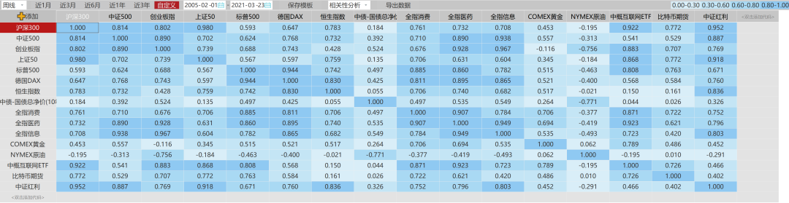

**相关性分析（2）**

本文写于2016年6月16日

https://mp.weixin.qq.com/s/dPtHLWQr6Bqt9tiLZTkW9Q

继续说我们根据相关性进行资产配置的问题。

 

拿出相关性分析图，对照着看。

▲向左滑动查看图片。说明：为了体现这几年的走势，本图于2021年3月更新。

## 首先，我们要确定一个基准配置

即：我们必须要配置什么。

对于我们来说，基准当然就是A股。

毕竟我们使用的钱是人民币，人也在国内，不考虑汇率问题.

还是要解决手头大量的人民币资产如何配置的问题。

所以，我们的基准资产就是A股。

看图。

A股资产中，我们必须将大盘股、小盘股区别开。

很简单，除非注册制开始，未来不管多少年，A股一定还是个喜欢炒作小盘股的地方。

成熟市场小盘股不受欢迎，在美国是因为非常容易退市，每年退市的比上市的少。

在香港是因为小盘股大量老千。股票动不动就十合一，1块钱跌到1毛，十合一之后又变成一块，然后再跌到1毛。你的100万就顺利变成了1万……

在A股，各种因素，导致小盘股非常安全。所以炒家都喜欢小盘股。

从历史上看，除非极端情况，大小盘股票的走势还是区别度不小。

大家看上证50和中证500的相关度只有0.62。

这虽然也是处在较强相关的范围内，但我想大家一定不愿意在2012年抄到大底，结果因为买了50，到了2014年才开始赚钱。这中间，人家小盘股已经经过了2年多的大牛市……所以，大小配置才重要。

**这就是另一个配置原则，在A股，我们配置大盘和小盘。**

那么，大盘选什么？

通常情况下，大盘指数就是50或者300。

当然还有别的，但最大的、流动性最好的宽基规模指数就是这两个。

对比50和300后我们可以发现，50和500、中小、创业等小盘指数相关性更低。

所以，我们可以考虑配置50。

那么50和300相关性达到0.973，有没有必要重复配置？

▲向左滑动查看图片。

这幅图是过去十二年50和300的走势对比图。据我的统计，长期来看，300走势要比50好。

尤其是在牛市中。

50的优势是熊市跌的少。在熊市中50通常是跌的最少的。

这也是我们etf计划现在大量配置50的原因。

为什么这个月开始买300？

因为在未来的攻坚战中，300会比50强。

**这是又一个原则：相关性之外，还要考虑波动率。**

熊市中选择波动率小的，牛市中选择波动率大的。

至于这两个能不能重复配置？

个人认为没有什么大问题。同时配也可以，不同时也可以。

也可以在合适的时候在两者之间转换，也可以只投一只。

总而言之，相关性极强的指数，未必不可以重复配置。

还要考虑波动率。

